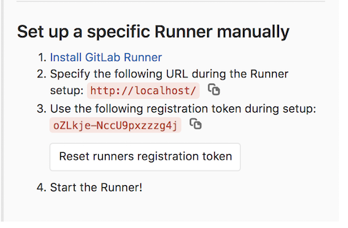

This folder contains all of the code for the Batfish enabled CI pipeline demonstration from Ansiblefest 2019.

# Running the demo

## Pre-requisites
* Gitlab and runner setup outlined below.
  * In Gitlab, create a new project
    * Recommend naming it `af19-template`
  * Register the runner with the project
* BF server running on localhost

Note:
You can reduce execution time of the demo by leveraging an existing virtual environment that has the necessary dependencies install. 
To leverage an existing environment, edit the `before_script` stage of the Gitlab-CI pipeline file `template.gitlab-ci.yml`.


### Gitlab setup on a Mac

#### Gitlab server

Make sure that you have Docker installed on your laptop

* Run the docker image 
```
docker run --detach \
  --publish 443:443 --publish 80:80 --publish 22:22 \
  --hostname localhost \
  --name gitlab \
  --restart always \
  --volume ${HOME}/gitlab/config:/etc/gitlab \
  --volume ${HOME}/gitlab/logs:/var/log/gitlab \
  --volume ${HOME}/gitlab/data:/var/opt/gitlab \
  gitlab/gitlab-ce:latest
```
The initialization process may take a long time. You can track this process with the command sudo docker logs -f gitlab

* Navigate to http://localhost/
  * Create an admin password
  * Register a new user
  * Create a new project
    * `AF19-Template`

    Initialize a README, but leave them private    
  * Add an SSH key to your profile so you can clone the repos
    * Via user icon on top right -> settings -> ssh key


##### Gitlab runner

###### Install GitLab runner
```
sudo curl --output /usr/local/bin/gitlab-runner https://gitlab-runner-downloads.s3.amazonaws.com/latest/binaries/gitlab-runner-darwin-amd64
sudo chmod +x /usr/local/bin/gitlab-runner
```

###### Register Gitlab runner with the project
This requires getting a token from Gitlab for the project.
Steps:
* Go to the project page
* Settings (left side menu) —> CI/CD -> Expand Runners

     


* Run `gitlab-runner register`
  * Enter the URL: `http://localhost/`
  * Enter the project specific Gitlab token from above 
  * Accept default value for description 
  * Accept the default value for tags
  * Enter `shell` as the executor


###### Start the Gitlab runner
* `gitlab-runner run` if the process is not already running
* `gitlab-runner restart` if the process is already running


### Environment variables

It is recommended that you setup the following environment variables:
* `GIT_TEMPLATE` - This is the Git Clone URL for the Template repo you setup in Gitlab
   * Example: `git@localhost:samir-demo/af19-template.git`

Then you setup the demos:

`bash run.sh`  

This command will do the following:
  * via `setup-git-repos.sh`, push content to the template repo. 
 
NOTE: This will reset the Git repository to the base state, so you can run the demo scenarios again.
  
## Running the demos

To run the demos you will need to have a local clone of the `af19-template` repo. Both demo scenarios require you to run an Ansible playbook from this directory

## Demo Scenario #1

The first demo involves adding a new leaf to the existing DC fabric. Run the following command:
```angular2
ansible-playbook -i playbooks/inventory playbooks/add_leaf.yml
```

Enter the following information when prompted:
* Enter the number for the new leaf router: `90`
* Enter the BGP AS number for the new leaf router: `65009`
* Enter commit message [adding leaf90 to fabric]: <enter>
  * this will accept the default commit message
  
And that's all you need to do to start the demo. In about 2-3 minutes you will see a new snapshot in Batfish. 

Navigate to the Gitlab project `AF19-Template` to see the pipeline execution logs. 
* The `build` stage of the pipeline builds all of the configurations. 
* The `test` phase uploads the configurations to the BF server and evaluates the policies. 
  * This is where you will see the results of the BF policy execution, under `policy_eval`
 
 
You should see 2 failures:
* Unique BGP AS
* All leaf routers have all host subnets

The leaf routers do not have `bgp allow-as in` configured, so `leaf09` and `leaf90` reject either others routes. 

To correct the error, re-run the ansible playbook with the correct BGP ASN - `65090`. 
* For correct operation each leaf should set the BGP AS to be equal to it's id/number

## Demo Scenario #2

The first demo involves adding a new leaf to the existing DC fabric. Run the following command:
```angular2
ansible-playbook -i playbooks/inventory playbooks/request_service.yml
```

Enter the following information when prompted:
* Direction of request flow. IN for opening up access to internal service from the internet. OUT for opening up access to external service: `IN`
* Enter the destination IP address/prefix: `10.100.10.0/24`
* Enter the source IP address/prefix: `0.0.0.0/0`
* Enter the IP protocol (TCP or UDP): `tcp`
* Enter the destination port: `443`
* Enter the name of the application: `SSL`
* Enter the change request id: `CHG12345`
* Enter commit message [Change request CHG123345 for access to 10.100.10.0/24 application SSL from 0.0.0.0/0]: <enter>
  * this will accept the default commit message


And that's all you need to do to start the demo. In about 2-3 minutes you will see a new snapshot in the BFE Dashboard with policy execution complete. 

Navigate to the Gitlab project `AF19-Template` to see the pipeline execution logs. 
* The `build` stage of the pipeline builds all of the configurations. 
* The `test` phase uploads the configurations to the BF server and evaluates the policies. 
  * This is where you will see the results of the BF policy execution, under `policy_eval`
  
  
You should see 1 test failure:

* Protect internal services (TCP)
  * Private subnets (new-TCP) reachability
 
This test fails because the network `10.100.0.0/16` has been designated as internal only. So traffic from the internet is allowed to it.

**NOTE**: If you want to re-run the scenario and select another subnet, you must provide a new `source IP prefix` and `application` since Capirca doesn't allow multiple entries for the same named object even if the definition is identical

## Restart demo

To restart the demo, go back to the window where you ran the demo setup script and re-run the script.
   
# Contents

## Policies

The `policies` folder contains pytest-based policies.  `conftest.py` has the test setup and the remaining files have different policies. These policies can be run on an already-initialized snapshot, or a snapshot can be initialized as part of running them if `BF_INIT_SNAPSHOT` environment variable is set to `yes`.

The `ansible-policies` folder contains Ansible-based policies. Ansible policy playbooks assume that the snapshot has already been initialized. 

## Gitlab pipelines 

`template.gitlab-ci.yml` has the pipeline content for template repo
